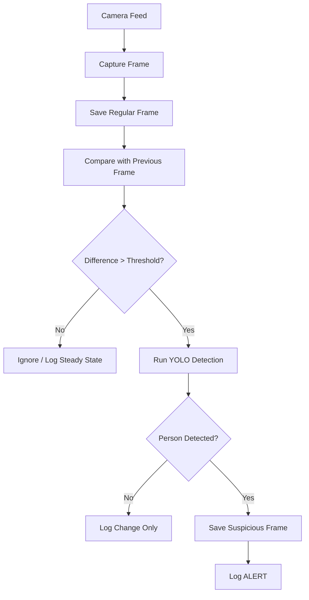
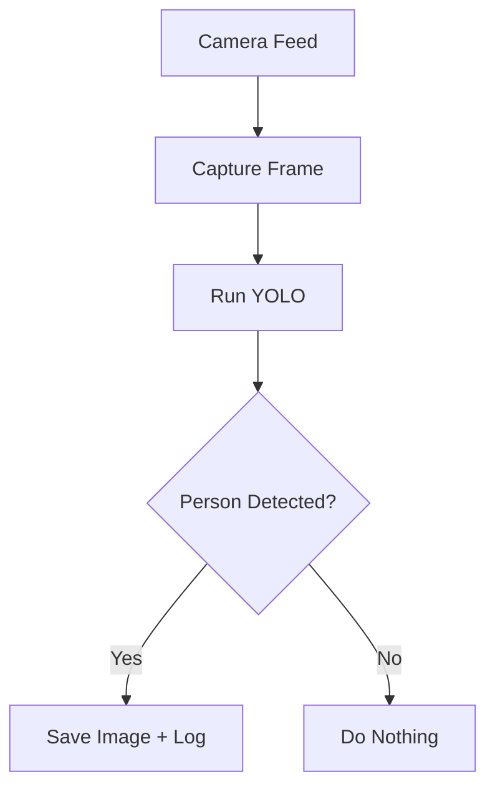
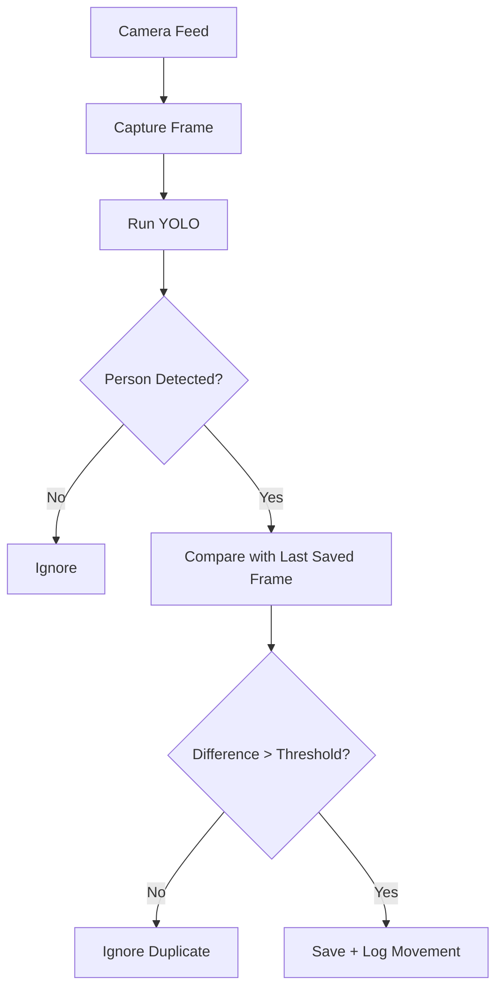
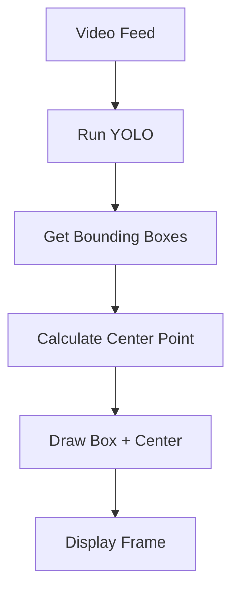
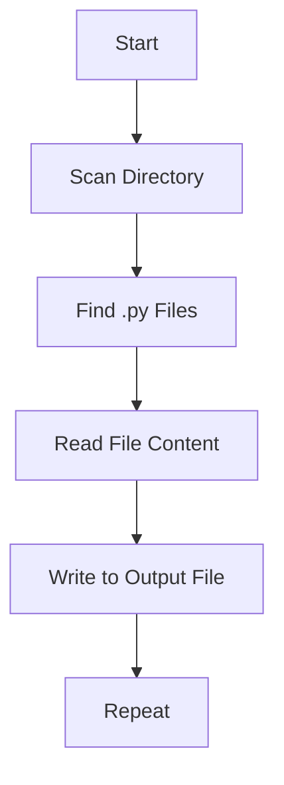
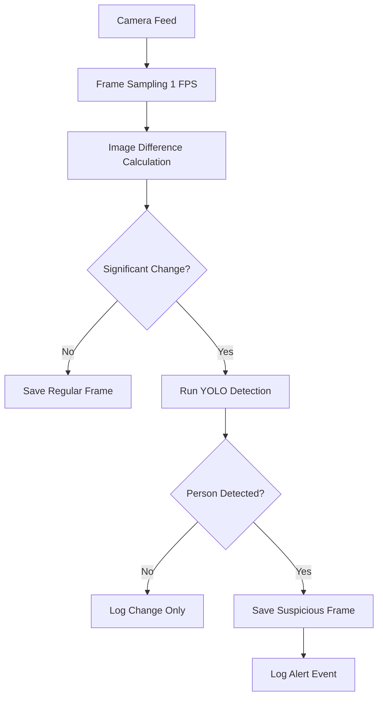

Alright — I see the style you’re going for:

* very **structured**
* very **explicit**
* includes **setup + deep explanation + flowcharts**
* slightly “student-project but thorough” vibe

I’ll match that style for your surveillance project 👇

---

# 🛡️ Smart Surveillance System

## All the versions so it'll be easy to run

built with Python 3.10+
ultralytics (YOLOv11)
OpenCV (cv2)
numpy

---

## Setup and Running

1. Install Python (if not installed)
   Download from: [https://www.python.org/downloads/](https://www.python.org/downloads/)

---

2. Install required libraries
   Open terminal in project directory and run:

```bash
pip install ultralytics opencv-python numpy
```

---

3. Clone the repository (if using git)

```bash
git clone <your-repo-link>
```

or download and unzip manually.

---

4. Make sure you have a camera source

* Webcam → default (`0`)
* IP Camera → replace with `rtsp://...`

---

5. Run the main system

```bash
python persim.py
```

---

6. Press `q` to exit the live feed window

---

## What this project is

This project is a **real-time AI-powered surveillance system** that detects human presence in a video feed.

Instead of running AI continuously, it uses:

* frame sampling (1 FPS)
* image difference detection (MSE)
* conditional AI inference (YOLO)

This makes the system:

* faster
* more efficient
* less storage-heavy

---

## What all the scripts do:

---

### *persim.py* ⭐ (Main System)

This is the **final integrated system** that combines:

* frame sampling
* change detection
* AI-based human detection
* logging and storage

#### Workflow:

1. Capture video feed from camera
2. Save 1 frame per second (regular logging)
3. Compare current frame with previous frame
4. If difference exceeds threshold → run YOLO
5. If a person is detected → save + log alert

---



---

### *person_done.py* (Baseline Detection)

This script performs **basic human detection**.

1. Captures frame every second
2. Runs YOLO on every frame
3. Saves image if a person is detected
4. Logs the event

❗ Inefficient because:

* AI runs even when nothing changes

---



---

### *person_similar.py* (Smart Filtering)

This script improves efficiency by:

* detecting only **significant movement**
* avoiding duplicate saves

#### Workflow:

1. Detect people using YOLO
2. Compare with last saved frame
3. Save only if movement is significant

---



---

### *tresing.py* (Detection + Localization Demo)

This script demonstrates:

* how YOLO detects people
* how to extract their position

#### Features:

* draws bounding boxes
* calculates center coordinates
* prints location of detected person

---



---

### *sho.py* (Utility Script)

This script collects all `.py` files and combines them into a single `.txt` file.

#### Workflow:

1. Traverse directory
2. Read all `.py` files
3. Append contents into one file

---



---

## Configuration Options

You can tweak the system behavior using:

* `CHECK_INTERVAL` → frame sampling rate
* `SIMILARITY_THRESHOLD` → sensitivity to motion
* `DETECTION_INTERVAL` → detection frequency

---

## Overall Work Flow



---

## Limitations

* Sensitive to lighting changes
* Fixed threshold may need tuning
* No tracking (same person counted multiple times)
* Works best with stable camera

---

## Future Improvements

* Add object tracking (DeepSORT)
* Replace MSE with SSIM (better accuracy)
* Add alert system (email / Telegram)
* Web dashboard for monitoring
* Edge deployment (Raspberry Pi)

---

## Credits

### - Your Name

GitHub: @yourusername

---

If you want, I can also:

* make this **cleaner + more “resume-grade”**
* or add **screenshots / demo section** which boosts impact a LOT
