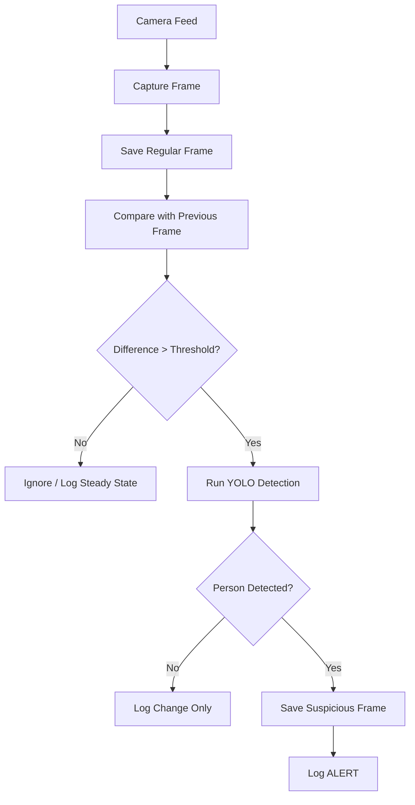
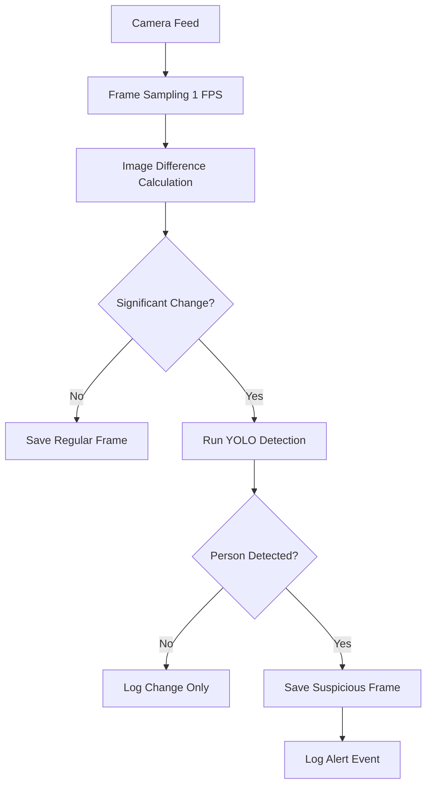

---

# Smart Surveillance System

## Behind the Idea
- A dear friend home has been tresspassed, he wanted to check hours and hours of footage. So we decided to use some open source tool to unburden his missery.
- We looked into many things like computation, we reduced the cost by using simple techniques, so it even runs on a computer with low processing power.
- This project will help by reducing the amount of footage we have to review.
- The log is formatted for easy understanding of what is happening.
- The 1 second interval is to reduce the cost of computation.
   
## setup we had
python==3.13.5
libraries required: ultralytics opencv-python numpy

## What this project is

This project is a **real-time AI-powered surveillance system** that detects human presence in a video feed.

Instead of running AI continuously, it uses:

* frame sampling (1 FPS)
* image difference detection (MSE)
* conditional AI inference (YOLO)

This makes the system:

* faster
* more efficient
* less storage-heavy

---

## What the script does:

---

### *persim.py* (Main System)

This is the **integrated system** that combines:

* frame sampling
* change detection
* AI-based human detection
* logging and storage

#### Workflow:

1. Capture video feed from camera
2. Save 1 frame per second (regular logging)
3. Compare current frame with previous frame
4. If difference exceeds threshold → run YOLO
5. If a person is detected → save + log alert

---

## Configuration Options

You can tweak the system behavior using:

* `CHECK_INTERVAL` → frame sampling rate
* `SIMILARITY_THRESHOLD` → sensitivity to motion
* `DETECTION_INTERVAL` → detection frequency

---

## Overall Work Flow

---

## Limitations

* Sensitive to lighting changes
* Fixed threshold may need tuning
* No tracking (same person counted multiple times)
* Works best with stable camera

---

## Future Improvements

* Add object tracking (DeepSORT)
* Replace MSE with SSIM (better accuracy)
* Add alert system (email / Telegram)
* Web dashboard for monitoring
* Edge deployment (Raspberry Pi)

---

## Credits

---
